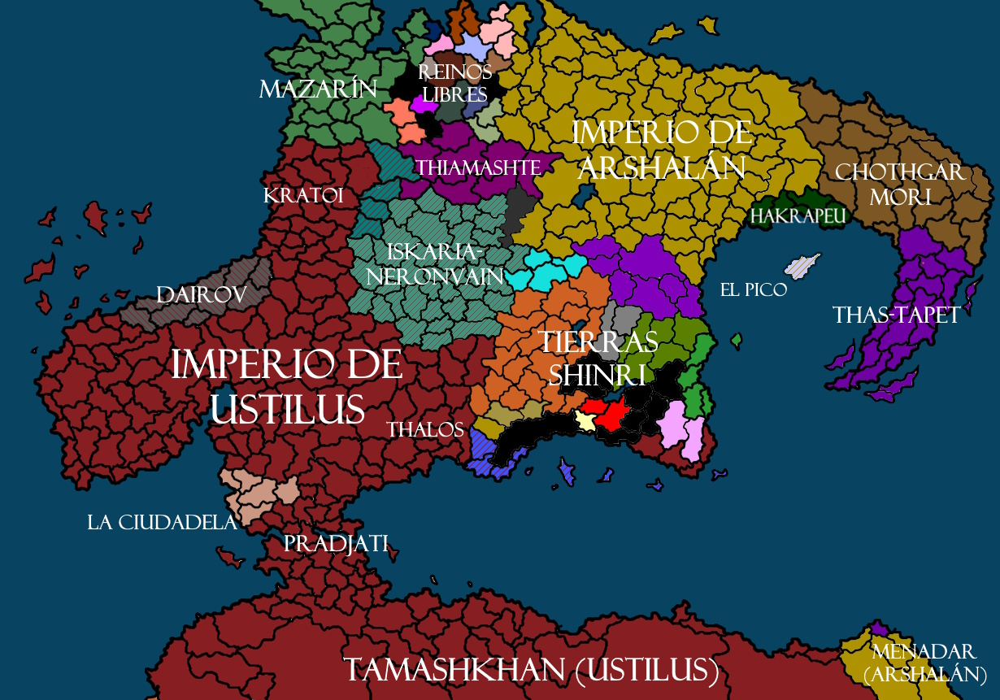

Raldamain es una tierra definida por ciclos de auge y caída, donde grandes imperios han nacido, florecido y colapsado, dejando atrás poco más que ruinas, mitos y legados disputados. Considerada como el corazón espiritual y político del mundo conocido, Raldamain ha atraído durante milenios migraciones y conquistas procedentes de continentes distantes. Es también venerada como la cuna espiritual del **[feynismo](../religiones/feynismo.md)** y el **[mekhatimismo](../religiones/mekhatimismo.md)**, dos de las religiones más importantes en la historia de la humanidad.

*FIG 1: Mapa de Raldamain en el año 4000 D. F*

La era presente se caracteriza por una profunda incertidumbre. La enigmática desaparición de [Feyn](../divinidades/feyn.md) ha sumido en la confusión al Imperio de [Ustilus](../lugares/ustilus.md), hasta entonces potencia hegemónica del continente. Mientras las estructuras tradicionales de poder se debilitan, una multiud de nuevos cultos e ideologías han empezado a proliferar, trayendo consigo visiones de renovación o de caos. A su vez, la naciente revolución industrial trae grandes transformaciones a las sociedades de Raldamain, introduciendo inventos y corrientes filosóficas que desafían creencias y modos de vida ancestrales. Para muchos, el mundo conocido se tambalea entre una era dorada de progreso sin precedentes y una amenaza existencial.

# Historia

Aunque los inicios de la humanidad en el continente aún siguen rodeados de misterio, lo poco que se conoce de sus primeros habitantes es el hecho que vivían en comunidades tribales que practicaban la idolatría. Aunque la mayoría de la población de entonces era humana, esta convivía en relativa paz con [elfos](../culturas/elfos.md), [urlok](../culturas/urlok.md), [leoninos](../culturas/leoninos.md) y otros pueblos hoy desaparecidos.

La primera gran transformación llegó con el descenso de **Feyn**, dios de la humanidad, al continente de Raldamain con el fin de enseñar y guiar a la humanidad. Este acontecimiento traería consigo la fundación de la religión Feynista y el inicio del calendario principal del continente. Los sucesores de Feyn acabarían estableciendo el **Imperio Nataneo**, una gran civilización célebre por sus ciudades voladoras y su inmenso conocimiento mágico.

Al llegar a su apogeo, los nataneos empezaron a separarse de las enseñanzas del dios de la humanidad y sucumbieron al orgullo y la ambición. En el año 2208 el emperador Tenebrio desafió abiertamente a Feyn e intentó usurpar su trono, desencadenando una la rebelión que culminaría con la ira del dios. Fuego llovió desde los cielos, terremotos quebraron la tierra, y el Imperio Nataneo fue aniquilado por completo, sumiendo a Raldamain en siglos de barbarie y caos.

Aunque los primeros siglos tras la caída fueron un periodo caracterizado por conflicto casi constante, con el tiempo la civilización humana volvería a levantarse. En el año 2481 el **Príncipe Zarin** unificó los principados del norte y fundó el **Reino de Mazarin**, el cual perduraría hasta la actualidad. Este reino se proclamó heredero de los Nataneos y buscó restaurar el dominio Feynista sobre todos los territorios que una vez pertenecieron a dicho imperio. Aunque logró expandir la religión Feynista y estabilizó momentáneamente el continente fragmentado, jamás alcanzaría la grandeza de su predecesor y todo intento de unificación resultaría en un fracaso. No obstante, Mazarin acabaría influyendo de forma decisiva en el surgimiento de **Ustilus**, un reino feynista que con el tiempo lo acabaría eclipsando.

El tercer milenio desde el descenso de Feyn traería enormes migraciones al continente de Raldamain, cambiando para siempre las culturas locales. En el año 3033 el **Príncipe Shin** de Xiangdi condujo una expedición hacia las tierras élficas, fundando colonias que desencadenaron guerras con elfos y espíritus. Con el tiempo aquellos colonos se convertirían en el pueblo **Shinri** y acabarían haciendo las paces con los espíritus gracias a la llegada de un héroe legendario conocido como el Encarnado. 

Más terrible fue la llegada de los **Rakashitas**, un pueblo adoradores infernales que llegó a las costas occidentales en el siglo XXXV y acabaría conquistando todo el reino de Ustilus. Este temible imperio supuso una amenaza a todo Raldamain hasta que inesperada la muerte de su emperador casi divino los fragmentó en numerosos estados enfrentados. 

En medio del caos, el general ustilés **Acrodio** lideró una rebelión exitosa contra los Rakashitas y fundó en 3496 el **Imperio de Ustilus**, dando inicio una nueva era. Con el tiempo los ustileses lograrían destruir  los restos del dominio rakashita y expandieron su poder por todo Raldamain, creando el mayor estado desde el Imperio Nataneo. Su auge los acabaría enfrentando con Mazarín, quien disputaba su puesto como reino elegido de Feyn, y con el **Imperio de Arshalán**, una nueva potencia dedicada a la fe Mekhatimista que luchó contra Ustilus en numerosas guerras santas. 

Tras varios siglos de expansión y conflicto, Ustilus acabaría alcanzando la hegemonía continental y llegaría a su máximo esplendor en el siglo XL. Profecías atribuidas a Acrodio anunciaban el retorno de Feyn en el año 4000, lo cual daría inicio a una nueva edad dorada que no había sido vista en el mundo desde tiempos de los nataneos. Sin embargo, aquel año acabaría marcado por la repentina desaparición de Feyn, un acontecimiento que sembraría dudas sobre los cimientos del feynisimo y daría paso a la actual era de incertidumbre.

# Geografía

El continente de Raldamain abarca una vasta diversidad de climas y paisajes, divididos en dos regiones principales conocidas como **Raldamain del Norte** y **Raldamain del Sur**, ambas separadas por **Canal Continental**. El norte se extiende desde costas templadas de estilo mediterráneo hasta gélidas extensiones polares mientras que el sur va desde desiertos áridos hasta densas selvas tropicales. Pese a siglos de exploración, grandes territorios permanecen sin cartografiar y las ruinas de civilizaciones olvidadas yacen ocultas en los lugares más remotos.

Más allá de la geografía natural, el continente porta la profunda huella de la magia y la influencia divina. Algunas regiones como las **Tierras Shinri** y la **Federación Élfica** se encuentran en la frontera entre el mundo espiritual y humano. Además, en el corazón del continente se abre la **Brecha Abisal**, un vasto abismo dentro de la Ciudadela del que emergen abominaciones procedentes de las profundidades de la tierra. Al sur se extienden los **Yermos Eternos**, un desierto lleno de magia caótica nacido de una devastadora guerra entre dos imperios tecnológicamente avanzados quienes se destruyeron mútuamente mediante armas mágicas. Estos territorios son un recordatorio constante de los riesgos de la ambición desmedida y de la fragilidad del dominio mortal sobre la naturaleza.

# Economía

# Dioses y Religión

# Magia y Tecnología